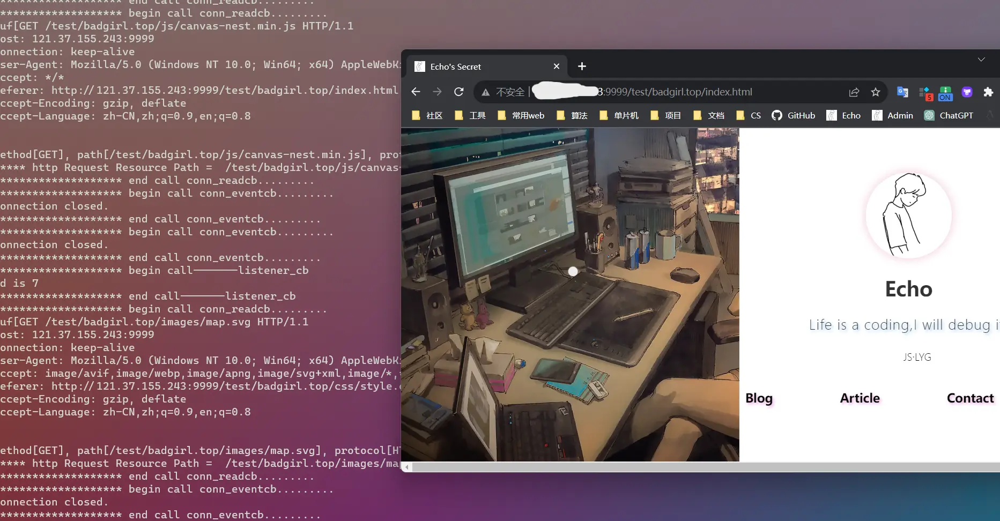
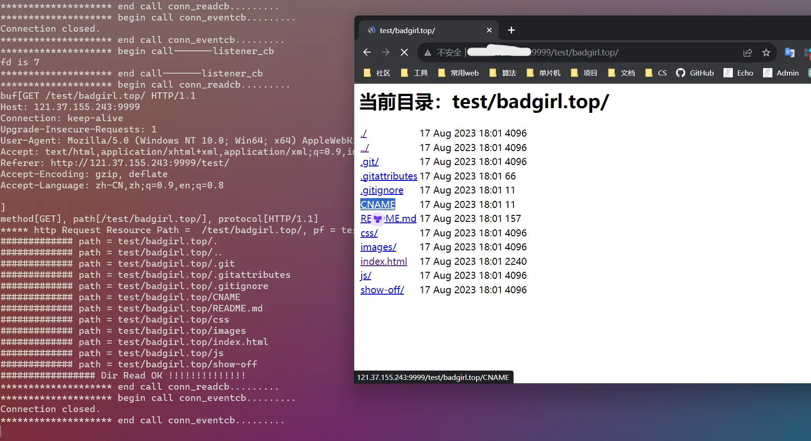

   

## 前言

基于黑马 linux 网络教程的小项目二次开发学习

## 介绍

基于 `libevent` 库，使用C语言开发的一个轻量级 `WebServer` 

## 部署场景

这个项目的目标场景是：

- 代码推送到 Linux 服务器
- 在服务器上安装依赖并编译
- 在服务器上直接运行二进制程序提供静态文件服务

下面的命令默认都应该在目标 Linux 服务器上执行。

## 环境准备

先安装编译工具链和 `libevent` 开发包：

```shell
sudo apt update
sudo apt install -y build-essential pkg-config libevent-dev
```

安装完成后，建议先确认 `pkg-config` 能识别 `libevent`：

```shell
pkg-config --modversion libevent
pkg-config --cflags --libs libevent
```

如果安装成功，第一条命令通常会输出类似 `2.1.12-stable` 的版本号。

## 获取代码

将仓库拉取到服务器，或将本地代码推送后在服务器上更新：

```shell
git clone https://github.com/PGwind/WebServer.git
cd WebServer
```

## 编译

推荐直接使用 `make`：

```shell
cd build
make
```

编译成功后，会在项目根目录生成可执行文件 `server`。

当前 `make` 已内置依赖检查：

- 如果服务器没有安装 `pkg-config`，会直接提示安装命令
- 如果 `pkg-config` 找不到 `libevent`，会直接提示安装 `libevent-dev`

也可以查看帮助：

```shell
cd build
make help
```

## 运行

可以使用启动脚本，也可以直接运行二进制。

### 方式一：使用 `start.sh`

```shell
chmod +x start.sh
./start.sh

# 也可以指定端口和静态资源目录
./start.sh 9999 /opt
```

### 方式二：手动运行

```shell
./server port path

# 举个例子：
./server 9999 /opt
```

其中，`port` 为指定的端口号，`path` 为访问根目录，访问链接为：`ip:port`

项目现在内置了默认 404 页面，不再依赖额外的绝对路径配置。

## 常见问题

### 1. `make` 提示 `pkg-config is not installed`

说明服务器缺少构建检查工具，执行：

```shell
sudo apt update
sudo apt install -y build-essential pkg-config libevent-dev
```

### 2. `make` 提示 `libevent development files were not found by pkg-config`

说明 `libevent` 开发包还没装，执行：

```shell
sudo apt update
sudo apt install -y libevent-dev
pkg-config --modversion libevent
```

### 3. 编译时报错 `event2/listener.h: No such file or directory`

这通常也是 `libevent-dev` 未正确安装导致的。重新安装后，再执行：

```shell
cd build
make clean
make
```

### 4. 运行时报 `Directory does not exist`

说明启动时传入的静态资源根目录不存在，检查第二个参数是否为服务器上的真实路径。

### 5. 低端口绑定失败

如果使用 `1024` 以下端口，通常需要更高权限。开发阶段建议先使用 `9999` 之类的非特权端口。

## 已优化

- 修复目录列表中的文件夹大小计算错误
- 内置默认 404 页面，去掉绝对路径依赖
- `start.sh` 支持自定义端口和静态资源目录

## 演示





