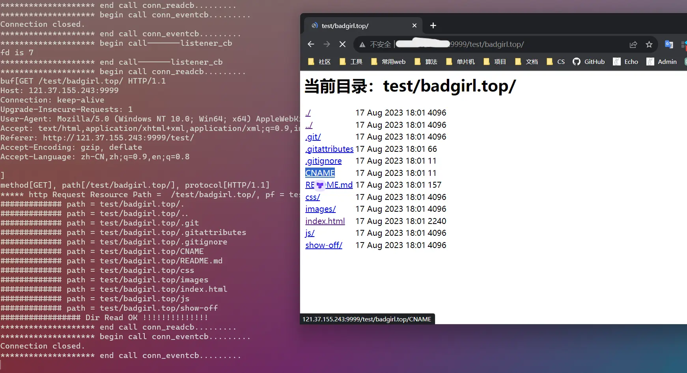

   

## 介绍

基于 `libevent` 库，使用C语言开发的一个轻量级 `WebServer` 

## 使用

首先安装 `libevent` 库

```shell
# 安装
sudo apt install libevent-dev
# 查看安装是否成功
pkg-config --modversion libevent 
# 如果安装成功，显示： 2.1.12-stable
```

接着 `clone` 项目

```shell
git clone https://github.com/PGwind/WebServer.git
cd WebServer
cd build
make
cd ..
./server port path

# 举个栗子： 
./server 9999 /opt
```

其中，`port` 为指定的端口号，`path` 为访问根目录，访问链接为：`ip:port`

## 注意

在 `source/libevent_http.c` 文件中，大概 `72` 行的 `send_error()` 函数，需要将404页面路径改为绝对路径

```c
int send_error(struct bufferevent *bev)
{
	send_header(bev, 404, "File Not Found", "text/html", -1);
	send_file_to_http("/WebServer/404page/404.html", bev); 	// 此处填写绝对路径，如 /opt/WebServer/404page/404.html

	return 0;
}
```

## 演示




