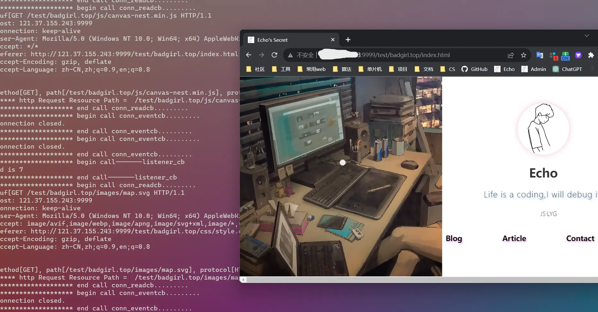

   

## 介绍

基于 `libevent` 库，使用C语言开发的一个轻量级WebServer

## 使用

```shell
git clone https://github.com/PGwind/WebServer.git
cd build
make
cd ..
./server port path
```

其中，`port` 为指定的端口号，`path` 为访问根目录，访问链接为：`ip:port`

## 演示




