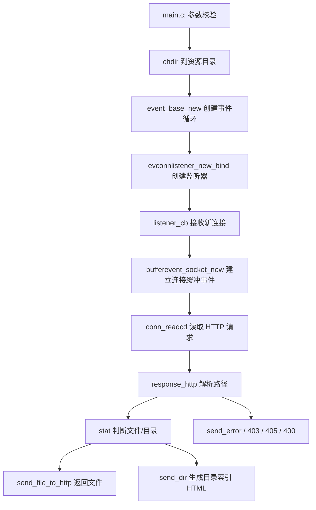

# WebServer Code Architecture

## 1. 项目介绍

这是一个基于 `libevent` 的轻量级单进程 HTTP 静态文件服务器，核心能力是：

- 监听 TCP 端口
- 解析浏览器发送的 HTTP GET 请求
- 根据 URL 映射本地文件或目录
- 返回文件内容或动态生成目录索引页面

如果面试官让你用一句话介绍项目，可以这样说：

> 我做了一个基于 libevent 的 C 语言静态 WebServer，使用事件驱动模型处理连接，支持目录浏览、文件下载和基础错误响应，重点练习了 socket、HTTP 协议解析、文件系统访问和 Linux 部署流程。

## 2. 项目目录结构

```text
WebServer/
├── page/
│   └── index.html              # 个人首页静态页面
├── build/
│   └── makefile                # 编译脚本
├── inc/
│   ├── libevent_http.h         # HTTP 服务核心声明
│   ├── total.h                 # 总头文件
│   └── url_conver.h            # URL 编解码、文件类型、目录大小统计
├── source/
│   ├── libevent_http.c         # 网络事件处理、HTTP 响应、目录渲染
│   ├── main.c                  # 程序入口、监听初始化、事件循环
│   └── url_conver.c            # 工具函数实现
├── start.sh                    # 一键编译并启动
├── README.md                   # 使用说明
└── ARCHITECTURE.md             # 当前这份学习文档
```

## 3. 整体架构



## 4. 核心执行流程

### 4.1 启动流程

程序入口在 `source/main.c`：

1. 读取命令行参数：端口号、静态资源根目录
2. 校验端口合法性
3. 调用 `chdir()` 切换到资源目录
4. 创建 `event_base` 作为事件循环核心
5. 调用 `evconnlistener_new_bind()` 监听指定端口
6. 注册 `SIGINT` 信号处理，支持优雅退出
7. 调用 `event_base_dispatch()` 进入事件循环

面试表达重点：

- 这是典型的 Reactor/Event Loop 模型
- 主线程不为每个连接创建线程，而是通过事件回调处理 I/O
- 对轻量静态资源服务来说，这种模型简单、资源开销低

### 4.2 请求处理流程

浏览器访问 `http://ip:port/path` 后，请求链路如下：

1. 新连接到达，触发 `listener_cb`
2. 为连接创建 `bufferevent`
3. 注册读回调 `conn_readcd`
4. `conn_readcd` 从 socket 中读取 HTTP 请求报文
5. 使用 `sscanf` 解析出 `method`、`path`、`protocol`
6. 如果是 `GET` 请求，进入 `response_http`
7. 对 URL 做解码，避免 `%20` 之类路径无法识别
8. 检查路径是否包含 `..`，拦截路径穿越
9. 调用 `stat()` 判断目标是文件还是目录
10. 如果是文件，发送响应头 + 文件内容
11. 如果是目录，动态生成 HTML 表格形式的目录页
12. 如果目标不存在或无权限，返回 `404` 或 `403`

### 4.3 断开与退出流程

- 连接结束或出错时，`conn_eventcb` 负责释放 `bufferevent`
- 用户按 `Ctrl + C` 时，`signal_cb` 触发 `event_base_loopexit()`，延迟 1 秒后退出事件循环

## 5. 模块职责拆分

## 5.1 `source/main.c`

职责：

- 程序入口
- 读取和校验参数
- 初始化监听 socket
- 初始化 `libevent` 事件循环
- 注册信号事件
- 驱动整个服务器生命周期

你可以把它理解为“控制层 / 启动层”。

## 5.2 `source/libevent_http.c`

职责：

- 处理连接建立与连接关闭
- 读取 HTTP 请求
- 解析 URL 并映射到本地文件系统
- 组织 HTTP 响应头
- 发送文件内容
- 生成目录列表页面
- 返回错误页

这是项目的核心业务层，最适合面试时重点讲。

关键函数：

- `listener_cb`
  - 接收新连接
  - 创建 `bufferevent`
  - 注册连接读写回调

- `conn_readcd`
  - 从连接中读取原始 HTTP 请求
  - 解析请求行
  - 分发到 `response_http`

- `response_http`
  - 路径解码
  - 安全校验
  - `stat()` 判断资源类型
  - 决定走“文件响应”还是“目录响应”

- `send_header`
  - 拼 HTTP 响应头
  - 负责状态码、Content-Type、Content-Length

- `send_file_to_http`
  - 循环 `read()` 文件内容
  - 调用 `bufferevent_write()` 发给客户端

- `send_dir`
  - 使用 `scandir()` 枚举目录
  - 使用 `lstat()` 获取条目元信息
  - 动态拼接成 HTML 页面

- `send_error`
  - 返回内置 404 页面

## 5.3 `source/url_conver.c`

职责：

- 处理 URL 编解码
- 根据文件扩展名推断 MIME 类型
- 递归统计目录大小

关键函数：

- `strdecode`
  - 把 `%20` 这样的 URL 编码转换成真实字符

- `strencode`
  - 把目录项名称重新编码后写回 HTML 链接

- `get_file_type`
  - 根据文件后缀返回 `Content-Type`

- `calculate_folder_size`
  - 递归遍历目录，累加文件大小

这个模块可以理解为“工具层”。

## 6. 项目中的关键技术点

## 6.1 事件驱动模型

为什么不用多线程？

- 小型静态服务器场景下，事件驱动足够
- 避免线程切换开销
- 代码结构更聚焦在 I/O 回调
- `libevent` 已经帮我们封装了事件监听和分发

面试中可以这样说：

> 这个项目没有采用 one-connection-one-thread，而是基于 libevent 的事件驱动模型。优点是实现简单、线程资源开销低，适合练习高并发网络编程的基础模型。

## 6.2 HTTP 最小实现

这个项目并没有实现完整 HTTP 服务器，而是实现了一个“最小可用子集”：

- 支持 `GET`
- 解析请求行
- 返回状态行
- 返回 `Content-Type`
- 返回 `Content-Length`
- 返回实体内容

这在面试里是加分点，因为你能明确知道项目边界，而不是把它说成“完整 Web 框架”。

## 6.3 文件系统映射

URL 到文件系统的映射方式很直接：

- 请求 `/a/b.txt`
- 服务器内部映射为当前资源根目录下的 `a/b.txt`

因为程序启动时执行了 `chdir(root_dir)`，后续路径解析相对简单。

## 6.4 安全处理

目前已经做的基础安全控制：

- 拦截 `..` 路径穿越
- 对不存在资源返回 `404`
- 对无权限资源返回 `403`
- 对不支持的方法返回 `405`
- 对非法请求行返回 `400`

你可以主动提一句：

> 这个项目不是生产级安全方案，但我补了基础路径校验和错误码处理，让它更接近真实服务端行为。

## 7. 典型请求案例

### 7.1 请求文件

浏览器访问：

```text
GET /README.md HTTP/1.1
```

处理过程：

1. `conn_readcd` 解析得到 `GET` 和 `/README.md`
2. `response_http` 将路径映射为 `README.md`
3. `stat()` 判断这是普通文件
4. `send_header()` 写入响应头
5. `send_file_to_http()` 分块读取并发送文件

### 7.2 请求目录

浏览器访问：

```text
GET /source HTTP/1.1
```

处理过程：

1. `response_http` 判断 `/source` 是目录
2. `send_dir()` 遍历目录下所有条目
3. 为每个条目生成超链接、修改时间、大小信息
4. 拼成 HTML 表格并返回浏览器

### 7.3 请求不存在资源

浏览器访问：

```text
GET /not_found.html HTTP/1.1
```

处理过程：

1. `access()` 或 `stat()` 失败
2. 调用 `send_error()`
3. 返回 `404 File Not Found`

## 8. 构建与运行方式

### 8.1 编译

`build/makefile` 负责构建：

- 读取 `source/*.c`
- 加入 `inc/` 头文件目录
- 优先通过 `pkg-config` 获取 `libevent` 的编译参数
- 生成根目录可执行文件 `server`

### 8.2 启动脚本

`start.sh` 做了三件事：

1. 清理旧产物
2. 重新编译
3. 使用指定端口和资源目录启动服务

例如：

```bash
./start.sh 9999 /opt
```

等价于：

```bash
./server 9999 /opt
```

## 9. 面试时可以重点讲的优化点

如果面试官问“你对项目做过哪些优化”，可以讲下面这些：

### 9.1 稳定性优化

- 修复了文件发送时未处理 `open/read` 失败的问题
- 增加了请求行解析失败时的 `400` 响应
- 增加了非 `GET` 方法的 `405` 响应
- 参数校验更严格，端口必须在合法范围内

### 9.2 安全性优化

- 增加路径穿越拦截，防止通过 `../` 访问根目录之外的文件
- 根据权限失败返回 `403`

### 9.3 工程化优化

- `start.sh` 支持端口和目录参数化
- `makefile` 支持 `pkg-config`，更适合 Ubuntu 部署
- 去掉了写死的 404 绝对路径依赖

### 9.4 功能正确性优化

- 修复目录列表中文件夹大小统计错误
- 目录和文件的响应逻辑更清晰

## 10. 项目局限性

这是面试里很重要的一部分。主动说局限性会显得你判断力更强。

目前项目还存在这些边界：

- 只支持 `GET`，不支持 `POST`、`PUT`
- HTTP 请求解析较简单，没有完整处理 Header
- 没有 Keep-Alive 长连接复用
- 没有日志模块和配置文件
- 没有线程池或进程池
- 没有缓存机制
- 目录页 HTML 比较原始
- 没有单元测试和压测数据

可以这样表达：

> 这个项目的定位不是生产级 Web 服务器，而是一个用于学习网络编程、事件驱动和 HTTP 基础协议处理的练习项目。我在这个边界内优先保证了核心链路可运行、代码结构清晰、部署方式简单。

## 11. 实习面试常见问法与回答思路

### Q1：为什么选择 `libevent`？

回答思路：

- 它对事件循环、socket I/O、多路复用做了封装
- 比直接手写 `epoll/select` 更容易聚焦业务逻辑
- 适合学习 Reactor 模型

### Q2：这个项目的核心难点是什么？

回答思路：

- HTTP 请求解析和资源映射
- 目录与文件两种响应分支
- 事件驱动回调链路梳理
- URL 编解码和路径安全控制

### Q3：为什么启动时要 `chdir(root_dir)`？

回答思路：

- 这样后续 URL 对应的资源路径可以直接按相对路径处理
- 降低路径拼接复杂度
- 让资源根目录成为天然的访问边界

### Q4：项目里有没有考虑安全问题？

回答思路：

- 做了基础路径穿越拦截
- 对权限问题和不存在资源区分不同状态码
- 但还不是完整的生产级安全方案

### Q5：如果继续优化，你会做什么？

回答思路：

- 支持更完整的 HTTP Header 解析
- 增加 Keep-Alive
- 使用 `sendfile` 优化大文件传输
- 增加配置文件
- 增加访问日志
- 增加单元测试和压测

## 12. 一段适合面试直接背的项目介绍

> 这是一个基于 C 语言和 libevent 实现的轻量级静态 WebServer。整体采用事件驱动模型，主流程是 main 初始化事件循环和监听器，新连接进入 listener 回调后通过 bufferevent 处理读事件，请求解析后根据 URL 映射本地文件或目录。对于普通文件返回 HTTP 头和文件内容，对于目录则动态生成 HTML 索引页。我在这个项目里主要关注了 HTTP 最小实现、文件系统访问、URL 编解码、路径安全校验，以及 Ubuntu 环境下的构建和部署流程。

## 13. 学习建议

如果你要拿这个项目准备实习面试，建议按这个顺序复习：

1. 先讲清楚项目做了什么
2. 再讲清楚启动流程和请求流程
3. 重点熟悉 `main.c`、`libevent_http.c`
4. 能说出 `libevent`、`bufferevent`、事件循环分别负责什么
5. 能说出你做过哪些优化
6. 能主动说明项目边界和下一步优化方向

只要你能把上面 6 点讲清楚，这个项目已经足够应对大多数实习面试中的项目介绍环节。
